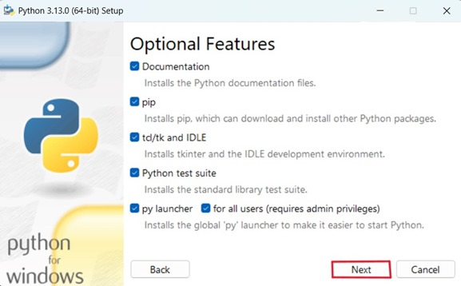
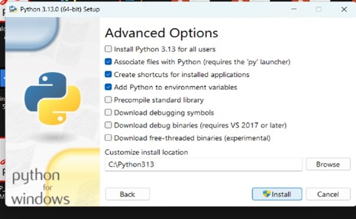
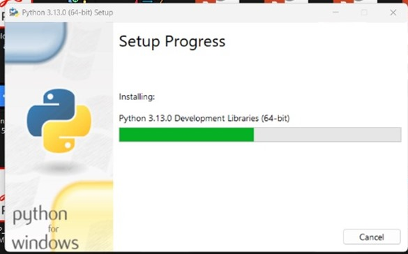
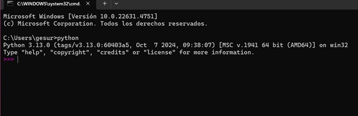
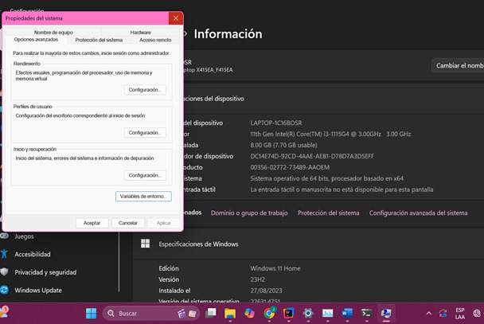

 
 <!--HEADINGS -->

# Instituto Tecnológico Superior de Chicontepec
Título del trabajo:
Instalación de Python.

Nombre:
Jana Gesuri Escudero Osorio.

Grupo:
A

Carrera:
Ingeniería en Sistemas Computacionales.

Nombre del docente.
ING. Said Jair Guerra.

Nombre de la materia:
Ecuaciones Diferenciales.

28 de enero de 2025.

# Descarga de Python
  
 Inicialmente, procedemos a la descarga del intérprete de Python desde su sitio web oficial.
  
  ---
  ___
.png)
 
 Posteriormente seleccionamos el apartado de descargas y elegimos la versión de Python compatible con el sistema operativo, en este caso Windows. 
  Damos clic en la versión de Python 3.13.1 y esperamos la descarga del archivo.Una vez descargado abrimos el archivo
  ---
  ___

.png)
En la carpeta de Descargas de nuestro equipo, buscamos el archivo  Python y ejecutamos el proceso de instalación
 ---
  ___

La primera pantalla permite seleccionar las opciones de instalación haciendo clic en  "Customize installation". Se aconseja seleccionar las opciones "Add Python.exe to PATH" para poder ejecutar programas desde la línea de comandos y Use admin privileges when installing py.exe.

---
  ___

En la pantalla "Optional Features", compruebe que están marcadas las casillas y se da  clic en "Next".

---
 ___

Una vez realizada la modificación/reparación, se mostrará la pantalla final. Haciendo clic en en el botón "Install"

---
 ___

La instalación de Python se ha completado con éxito. Ahora puedes comenzar a utilizar este lenguaje de programación para futuros proyectos. 
 ---
 ___

Para verificar la instalación del lenguaje se recomienda ir  a cmd y comprobar la instalación, en este caso fue exitosa la instalación y aparece la versión de Python.

 # Configuración de las variables de entrono
---
 ___

Para verificar la configuración de las variables de entrono, seleccionamos las propiedades del sistema y seleccionamos la opción de variables de entorno.

---
 ___

.png)
Como se muestra en la imagen, podemos ver que las variables de entorno se encuentran seleccionadas en Path.
Las variables de entorno PATH son cruciales para el funcionamiento de Python, ya que determinan las rutas de búsqueda que el sistema operativo utilizará para localizar programas ejecutables.

